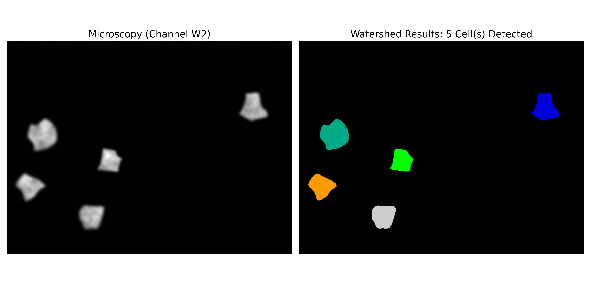
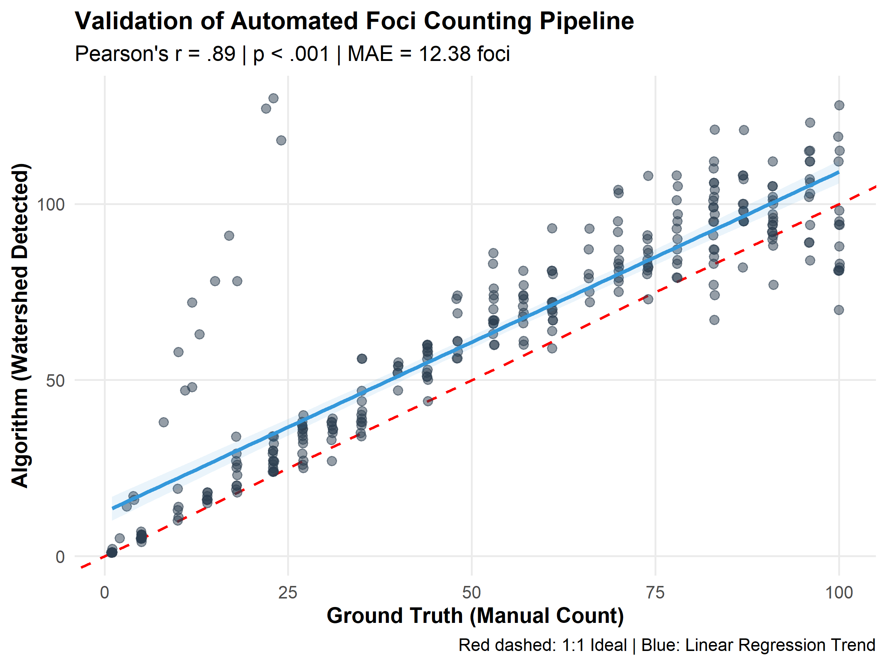

# Automated Data Pipeline for RNAi Research (Cell Counting and Identification)

## The Objective
The primary objective of this project was to develop an automated, reproducible pipeline 
using Python and Scikit-image to perform nuclear segmentation. This system serves as the 
foundational computational step required for the analysis of DNA damage markers, such as 
Rad51 and γ-H2A.X, as characterized in the study of RNAi-mediated genome protection by 
Lee et al. (2021). While the protocol described in the aforementioned study relies on identifying 
macronuclei (MACs) to normalize foci counts and calculate nuclear-to-cytoplasmic ratios, this 
pipeline seeks to automate the initial identification and counting phase to ensure 
high-throughput viability and objective consistency.

## Problem Statement
The quantification methods described in Lee et al. (2021; doi.org/10.1091/mbc.E20-10-0631) 
utilize sophisticated 
custom macros to segment macronuclei (MACs) and normalize DNA damage markers. These 
protocols represent the established gold standard for the author
s lab's current research. The challenge addressed in this technical supplement is not the invention 
of a new biological 
metric, but rather a partial and incomplete computational reproduction of the image processing 
workflow in a high-throughput Python environment.

By utilizing the BBBC005 dataset (bbbc.broadinstitute.org/BBBC005), which mimics the adjacent 
macronuclei and manual adjustment scenarios described in the paper, this demonstration tests 
the efficacy of Watershed Segmentation as a standardized solution for object separation. The 
objective is to validate a reproducible, automated script that aligns with the lab's existing 
rigor while leveraging the batch-processing power of Scikit-image.

## Methods
The computational workflow was developed in Python using the scikit-image and scipy.ndimage 
libraries to replicate the multistep segmentation logic required for nuclear analysis. The 
process follows a linear pipeline designed for batch-processing efficiency.

### Dataset and Ground Truth
The pipeline was validated using a subset of the BBBC005 synthetic dataset. This dataset 
was selected because it provides a known ground truth for object counts 
(encoded in the filenames as "C" values), which allows for the calculation of error margins. 
The images utilized for this program specifically mimicked widefield microscopy with varying 
focus levels and a high degree of object clustering, simulating the technical challenges found 
in macronuclear (MAC) imaging.

### Image Processing Pipeline
While the BBBC005 dataset provides native grayscale images, the pipeline first performs data 
type normalization, ensuring all pixel intensities are represented as floating-point values 
for calculation. To handle the noise typical of fluorescent microscopy, a Gaussian filter is 
applied. This provides subtle denoising that preserves the edges of the macronuclei while 
smoothing the intra-nuclear pixel variance that can cause over-segmentation. Following denoising, 
Otsu’s Method is used to calculate an optimal global threshold, effectively isolating the 
foreground nuclear signal from the background. To resolve adjacent macronuclei a Euclidean 
Distance Transform is applied to the binary mask. The local maxima of this transform are 
identified as unique seeds for the Watershed algorithm. This process mathematically defines 
boundaries where adjacent nuclei contact, ensuring each biological unit is labeled individually. 

 
 (Figure 1: Representative Segmentation Results using Watershed Transformation.
A side-by-side comparison of raw microscopy (Channel W2) and the resulting automated mask.)

A regular expression (Regex) parser extracts the true count from each filename. This allows the 
program to compare the algorithm's detected count against the expected count. The final results, 
comprising filename, true count, detected count, and error, were exported as a CSV file. This 
structured data serves as a bridge for statistical analysis in R, allowing for the generation 
of "Predicted vs. Actual" regression plots to quantify the pipeline's sensitivity and specificity.

## Results and Evaluation
The pipeline’s performance across the 300-image validation set yielded a Pearson correlation 
of r = .89 (p < .001), but with a Mean Absolute Error (MAE) of 12.38. As seen in the validation 
plot, the algorithm exhibits a consistent bias, generally over-counting objects compared to the 
ground truth. This over-counting is primarily driven by a critical technical failure at Focus 
Level 7 (F7), where a specific lack of edge contrast prevents the distance transform from 
identifying a single clear center for each nucleus. This results in the algorithm "shattering" 
a single blurry nucleus into multiple smaller fragments, leading to the massive error spike 
observed in the aggregate data.

Interestingly, the error rate does not follow a linear path of degradation as image 
quality worsens. While one might expect the error rate to increase steadily as blur increases, 
the discrepancy peaks aggressively at F7 and then returns to a more stable error rate at 
greater blur levels. This suggests that F7 represents a unique point of mathematical ambiguity 
for the Watershed algorithm, whereas higher levels of blur likely smooth the signal so 
completely that the false peaks are no longer detected. This non-linear performance gap 
highlights the limits of a standard Gaussian-filtered approach and indicates that while 
the pipeline successfully automates the first step of the methodology of Lee et al. (2021), 
it is not yet robust enough to replace manual oversight for datasets prone to significant 
focus drift.

This project establishes a functional Python-based scaffold for nuclear identification, but 
the 12.38 MAE confirms it remains a prototype for high-quality imagery rather than a universal 
solution. The success in segmenting sharp images, such as the C5 sample, proves the underlying 
logic is sound, yet the F7 failure point serves as a clear indicator that future iterations 
require adaptive local thresholding to handle low-signal environments. Ultimately, this analysis 
provides the necessary technical audit to transition from manual ImageJ workflows to a scalable, 
albeit currently focus-sensitive, automated pipeline.

